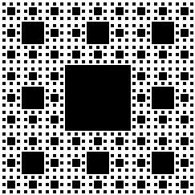

# Генерация ковра Серпинского с использованием OpenMP и OpenCV

## 1. Постановка задачи
Программа реализует параллельное построение фрактала "Ковер Серпинского" с:
- Рекурсивным алгоритмом генерации
- Параллелизацией через OpenMP
- Визуализацией с использованием OpenCV
- Сохранением результата в PNG файл

## 2. Основные функции и технологии

### Ключевые функции:
```
isPowerOfThree()      # Проверка что размер - степень тройки
drawSierpinskiCarpet()# Рекурсивная отрисовка фрактала
omp_set_num_threads() # Установка числа потоков
imwrite()             # Сохранение изображения
```

### Используемые технологии:
* OpenMP для параллельной обработки (pragma omp parallel for)
* OpenCV для визуализации и сохранения
* Рекурсивный алгоритм с условием остановки по глубине

## 3. Ввод/Вывод
### Входные параметры (аргументы командной строки):
```
./main [size=729] [depth=5] [threads=auto] [output.png]
# size   - размер изображения (должен быть 3^n)
# depth  - глубина рекурсии
# threads- число потоков (по умолчанию - auto)
# output - имя файла для сохранения
```
### Выходные данные:
```
sierpinski_carpet.png  # Изображение фрактала
```

## Пример запуска:

```
g++ -fopenmp -O3 main.cpp -o main -IC:/OpenCV-MinGW-Build/include -LC:/OpenCV-MinGW-Build/x64/mingw/lib -lopencv_core452 -lopencv_highgui452 -lopencv_imgcodecs452 -lopencv_imgproc452

# Запуск программы
./main.exe

# Или
./main 243 4
```

