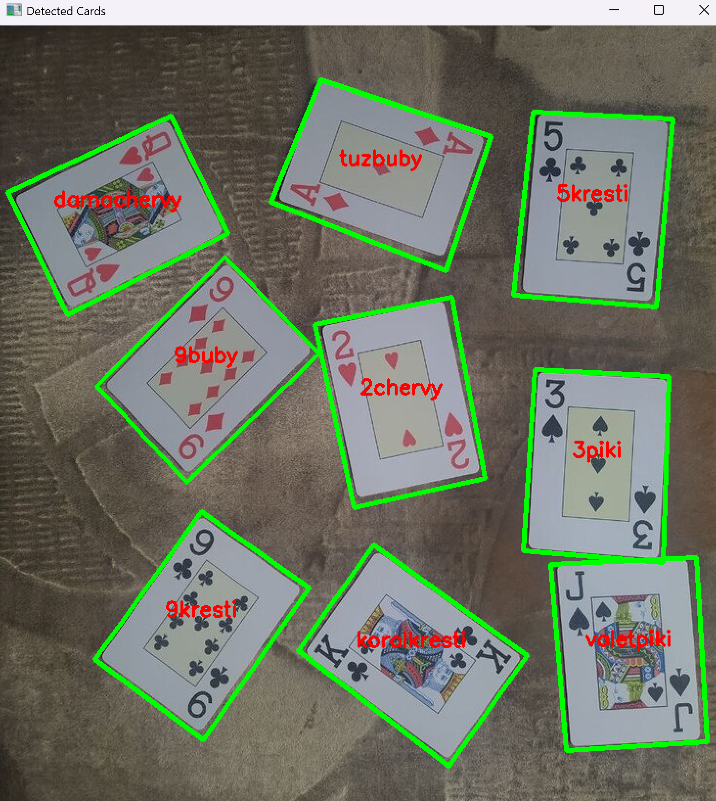

# **README: Детектирование карт на изображении с помощью SIFT и сопоставления ключевых точек**  

## **1. Описание задачи**  
Программа ищет заданные карты (шаблоны) на целевом изображении (`target.png`), используя алгоритм **SIFT** для детектирования ключевых точек и их дескрипторов. Затем она находит совпадения между шаблонами и целевым изображением, применяя **фильтрацию по соотношению расстояний** и **геометрическую проверку через гомографию**. Найденные карты выделяются зелёными прямоугольниками и подписываются.  

---

## **2. Основные функции и термины**  

### **Структуры данных**  
- **`SampleData`** – хранит информацию о шаблоне (карте):  
  - `name` – название файла (без расширения)  
  - `image` – изображение карты (`cv::Mat`)  
  - `keypoints` – ключевые точки, найденные SIFT (`std::vector<cv::KeyPoint>`)  
  - `descriptors` – дескрипторы ключевых точек (`cv::Mat`)  

### **Функции**  
- **`ratio_test(matches12, ratio)`** – фильтрует совпадения по **тесту соотношения расстояний Лоу**:  
  - Оставляет только те совпадения, где расстояние до ближайшего соседа значительно меньше, чем до второго (`distance < ratio * distance2`).  
  - Возвращает "хорошие" совпадения (`std::vector<cv::DMatch>`).  

### **Основные шаги алгоритма**  
1. **Загрузка шаблонов** (`cards/*.png`):  
   - Чтение изображений из папки `cards`.  
   - Поиск ключевых точек и дескрипторов с помощью **SIFT**.  

2. **Обработка целевого изображения** (`target.png`):  
   - Детектирование ключевых точек и дескрипторов.  

3. **Сопоставление шаблонов с целевым изображением**:  
   - Используется **Brute-Force Matcher (BFMatcher)** с метрикой **L2-нормы**.  
   - Применяется **kNN-сопоставление (k=2)** для каждого дескриптора.  
   - Фильтрация совпадений через `ratio_test` (удаляет ложные срабатывания).  

4. **Геометрическая проверка (гомография)**:  
   - Если найдено ≥4 хороших совпадения, вычисляется **матрица гомографии** (`cv::findHomography`).  
   - Проецируются углы шаблона на целевое изображение (`cv::perspectiveTransform`).  
   - Если площадь проекции ≥1000 пикселей, карта считается найденной.  

5. **Визуализация результата**:  
   - Найденные карты обводятся **зелёным прямоугольником**.  
   - В центре прямоугольника выводится **название карты**.  

---

## **3. Ключевые термины**  
| Термин                                       | Описание                                                                 |
| -------------------------------------------- | ------------------------------------------------------------------------ |
| **SIFT (Scale-Invariant Feature Transform)** | Алгоритм для поиска ключевых точек, инвариантных к масштабу и повороту.  |
| **KeyPoint**                                 | Точка интереса на изображении (координаты, масштаб, ориентация).         |
| **Descriptor**                               | Вектор признаков, описывающий окрестность ключевой точки.                |
| **BFMatcher (Brute-Force Matcher)**          | Перебор всех дескрипторов для поиска ближайших совпадений.               |
| **kNN (k-Nearest Neighbors)**                | Поиск `k` ближайших соседей для каждого дескриптора.                     |
| **Ratio Test**                               | Фильтрация ложных совпадений по соотношению расстояний.                  |
| **Homography**                               | Матрица преобразования (3×3), связывающая два изображения одной сцены.   |
| **RANSAC**                                   | Алгоритм для оценки параметров модели (гомографии) в зашумленных данных. |

---

## **Выходные данные**  
- Окно с изображением `target.png`, где найденные карты выделены **зелёными прямоугольниками** и подписаны.  

---