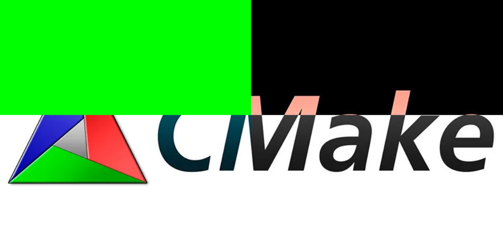
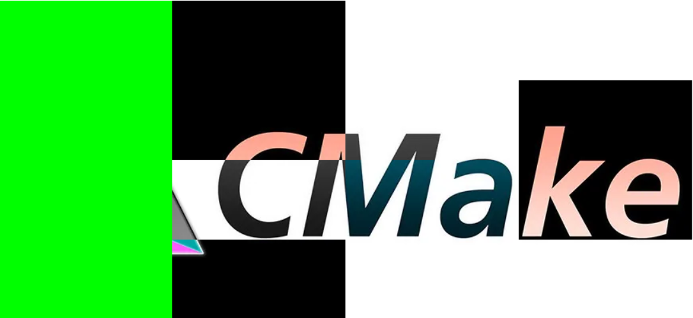

# OpenCV Image Segmentation & Processing

Этот проект использует OpenCV для загрузки изображения, разделения его на сетку (2×2, 3×3 или 4×4) и применения различных эффектов к отдельным сегментам.

## 🚀 Функциональность
- Загружает изображение из указанного пути.
- Делит изображение на сетку (2×2, 3×3 или 4×4) в зависимости от ввода пользователя.
- Применяет различные эффекты к сегментам:
  - **Кратные 4** → Заливка зелёным (`Scalar(0, 255, 0)`).
  - **Кратные 3** → Преобразование в оттенки серого.
  - **Нечётные индексы** → Инверсия цветов (`bitwise_not`).
- Отображает оригинальное и обработанное изображения.

## 🔧 Требования
- OpenCV (`opencv2`)
- Компилятор с поддержкой C++ (например, `g++` или `MSVC`)

## 💻 Установка и запуск
1. Склонируйте репозиторий или сохраните код.
2. Убедитесь, что OpenCV установлен в системе.
3. Скомпилируйте и запустите код

### Для code runner
```
"cpp": "cd $dir && g++ $fileName -o $fileNameWithoutExt -IC:/OpenCV-MinGW-Build/include -LC:/OpenCV-MinGW-Build/x64/mingw/lib -lopencv_calib3d452 -lopencv_core452 -lopencv_dnn452 -lopencv_features2d452 -lopencv_flann452 -lopencv_highgui452 -lopencv_imgcodecs452 -lopencv_imgproc452 -lopencv_ml452 -lopencv_objdetect452 -lopencv_photo452 -lopencv_stitching452 -lopencv_video452 -lopencv_videoio452 && $dir$fileNameWithoutExt",
```
### Оригинал 2x2:


### Обработанное 2x2:


### Обработанное 4x4:
