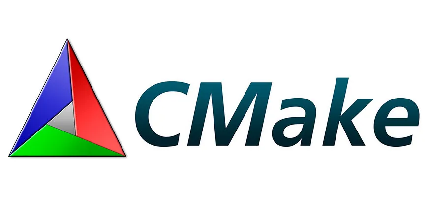
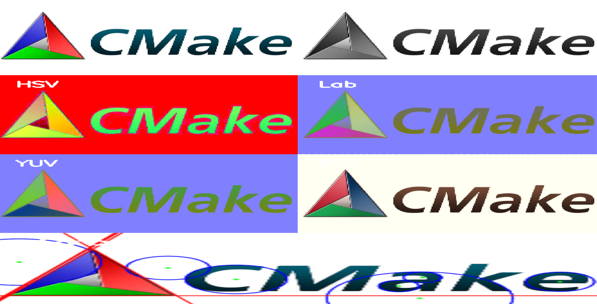

# Обработка изображений с использованием OpenCV

Эта программа демонстрирует базовые методы обработки изображений с использованием библиотеки OpenCV. Программа загружает изображение, преобразует его в различные цветовые пространства, а также обнаруживает и рисует круги и линии на изображении.

## Описание функций

### `addLabel(cv::Mat &image, const std::string &label)`
Добавляет текстовую метку на изображение.  
**Параметры:**
- `image`: Изображение, на которое будет добавлена метка.
- `label`: Текст метки.

### `ensureSameFormat(cv::Mat img, const cv::Size &size)`
Приводит изображение к единому формату (3-канальному BGR) и размеру.  
**Параметры:**
- `img`: Входное изображение.
- `size`: Размер, к которому нужно привести изображение.  
**Возвращает:** Изображение в формате BGR с заданным размером.

### Основные шаги обработки в `main()`
1. **Загрузка изображения**:  
   Изображение загружается из файла `image.webp`. Если файл не найден, программа завершается с ошибкой.

2. **Преобразование в оттенки серого**:  
   Исходное изображение преобразуется в градации серого с помощью функции `cv::cvtColor`.

3. **Размытие Гаусса**:  
   К изображению применяется размытие Гаусса для уменьшения шума с помощью функции `cv::GaussianBlur`.

4. **Обнаружение кругов**:  
   Используется метод Хафа (`cv::HoughCircles`) для обнаружения кругов на изображении. Обнаруженные круги отрисовываются на изображении.

5. **Обнаружение линий**:  
   Используется метод Хафа (`cv::HoughLines`) для обнаружения линий на изображении. Обнаруженные линии отрисовываются на изображении.

6. **Преобразование в различные цветовые пространства**:  
   Исходное изображение преобразуется в следующие цветовые пространства:
   - HSV (`cv::COLOR_BGR2HSV`)
   - Lab (`cv::COLOR_BGR2Lab`)
   - YUV (`cv::COLOR_BGR2YUV`)
   - XYZ (`cv::COLOR_BGR2XYZ`)

7. **Отображение результатов**:  
   Все этапы обработки (исходное изображение, обработанное изображение, градации серого, HSV, Lab, YUV, XYZ) отображаются в виде сетки изображений с помощью функций `cv::hconcat` и `cv::vconcat`.

8. **Вывод результатов**:  
   Итоговая сетка изображений отображается в окне с помощью `cv::imshow`.

### Оригинал:

### Результат:
