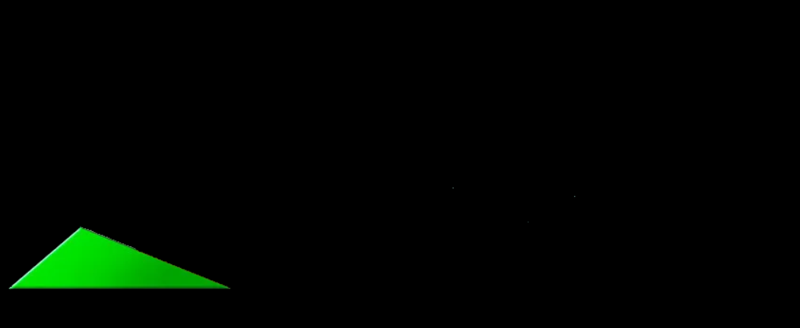
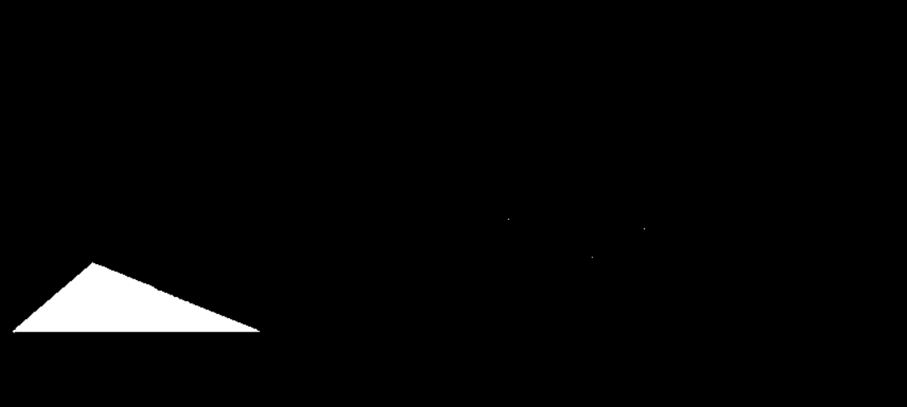

# Проект: Обработка изображений с использованием OpenCV

## Постановка задачи
Цель программы — обработать изображение, выделяя на нём области красного и зелёного цветов. Это достигается путём преобразования цветовой модели в HSV и применения масок для выделения нужных оттенков.

## Описание функций
1. **Загрузка изображения**:
   - Программа загружает изображение по указанному пути.
   - Если изображение не удалось загрузить, выводится сообщение об ошибке.

2. **Преобразование цветового пространства**:
   - Изображение преобразуется из BGR (синий, зелёный, красный) в HSV (тон, насыщенность, значение) для упрощения работы с цветами.

3. **Создание масок для красного и зелёного цветов**:
   - Для красного цвета создаются две маски, так как красный цвет в HSV находится в двух диапазонах (0-10 и 160-180).
   - Для зелёного цвета создаётся одна маска в диапазоне (35-85).

4. **Применение масок к изображению**:
   - Маски применяются к исходному изображению для выделения соответствующих цветов.

5. **Отображение результатов**:
   - Программа отображает исходное изображение, маски и результаты обработки в отдельных окнах.

## Результат вывода
Ниже приведены примеры изображений, которые выводятся программой:

 
 